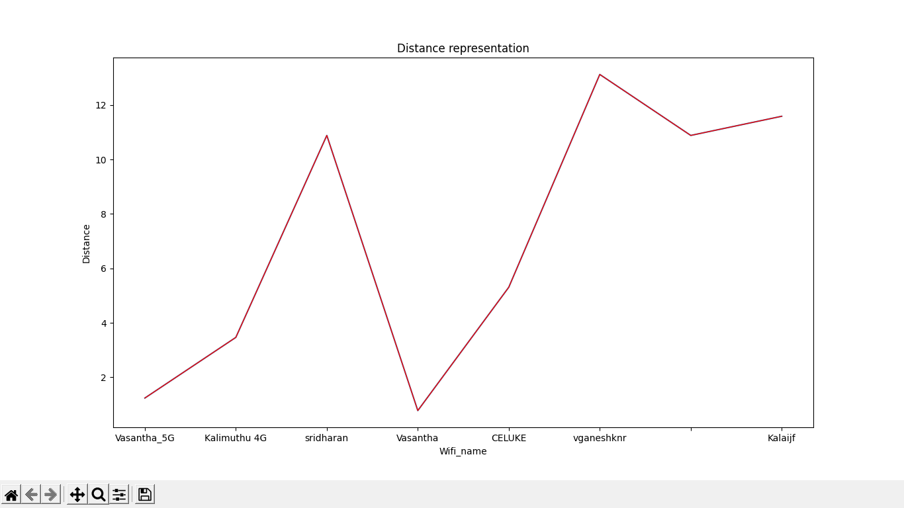
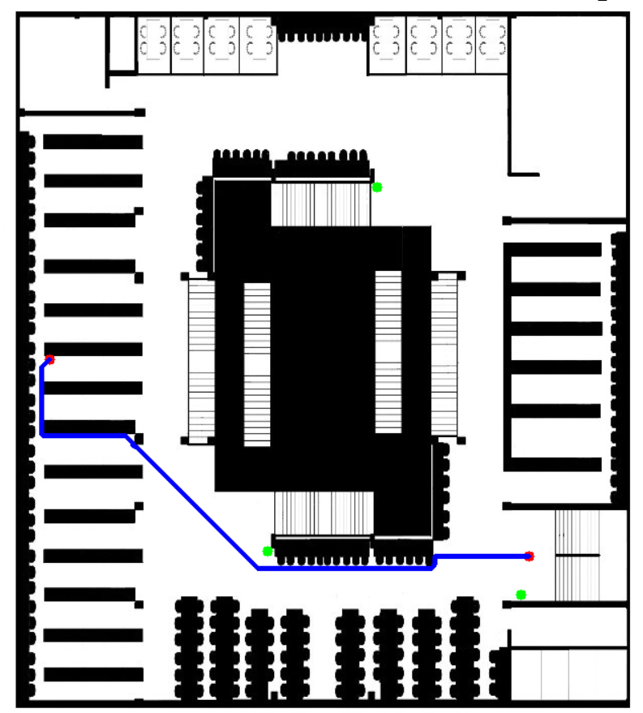
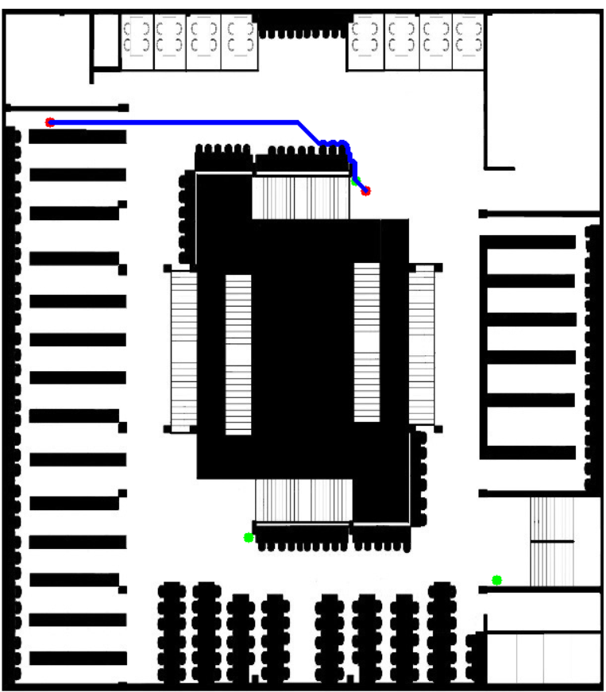

### <h3>Hi there 👋</h3>

  Outdoor positioning is done with GPS. However, it isn't ideal for indoor navigation. Thus, WiFi and RFID can be used to achieve Indoor Positioning. These Received Signal Strength Indicator (RSSI)- based techniques have some constraints in terms of precision and deployment, further Wi-Fi based positioning technique requires additional hardware support. Hence currently Bluetooth 4.0 and Bluetooth Low Energy are used.

  The main focus of this project is to implement a Distributed BLE based positioning mechanism. This is a cost effective mechanism that creates a signal-to-distance reference list which is then utilized to precisely locate a person. The performance of the BLE based positioning mechanism against Wi-Fi is evaluated in the library environment. 
  
<b>Wifi Name (source) vs User Distance Represtation :</b>
  

<b>Indoor Positioning -</b>   
 

 

